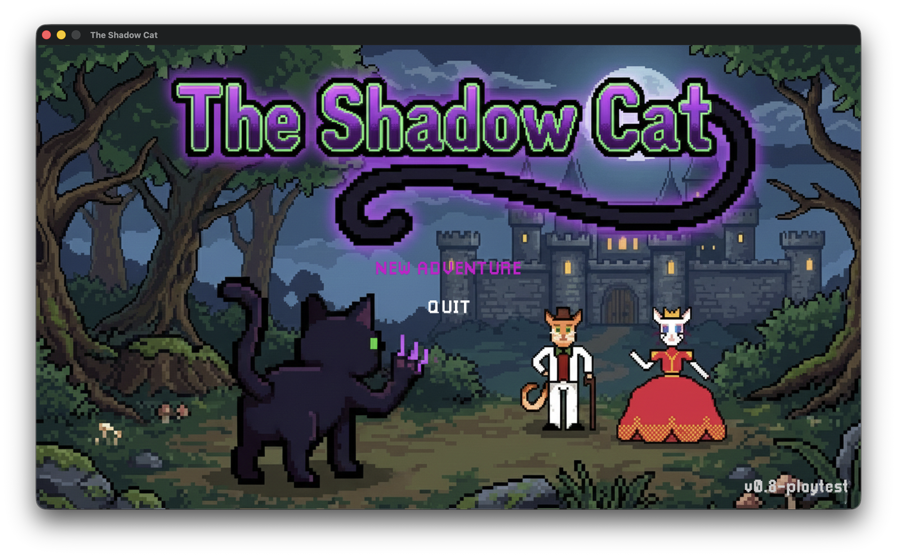
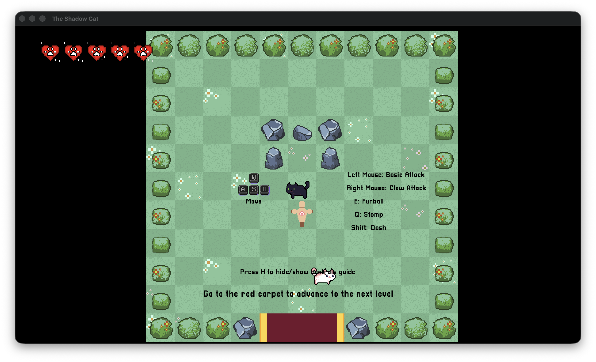
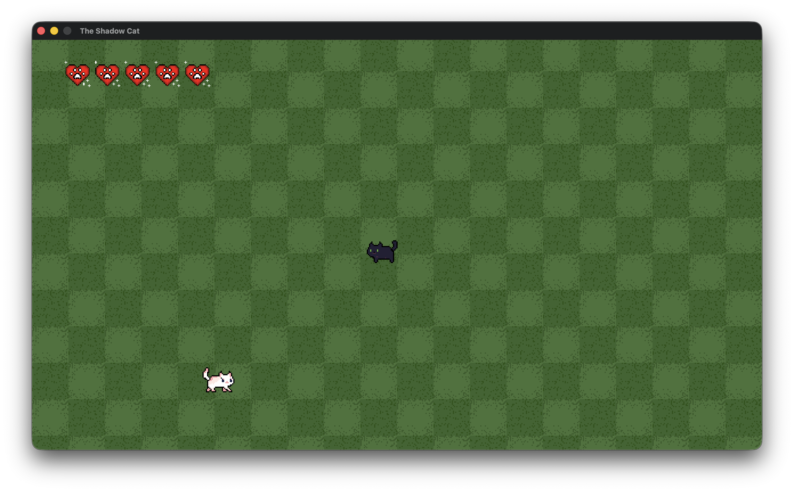
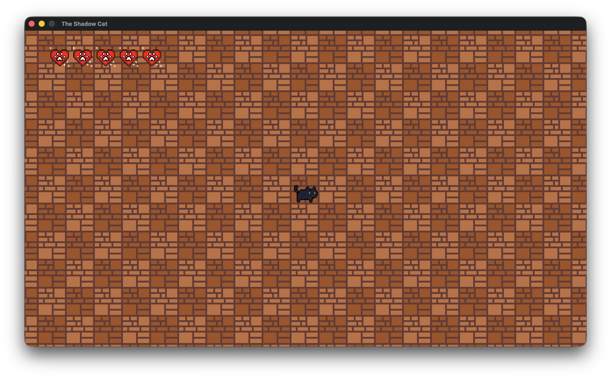
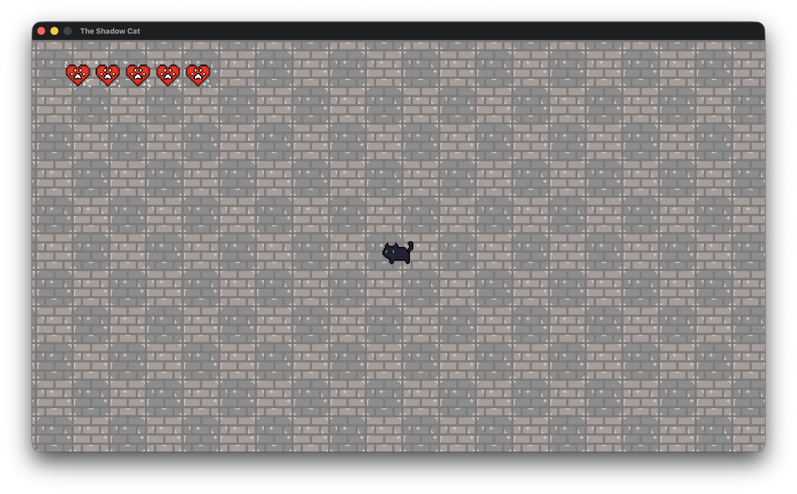
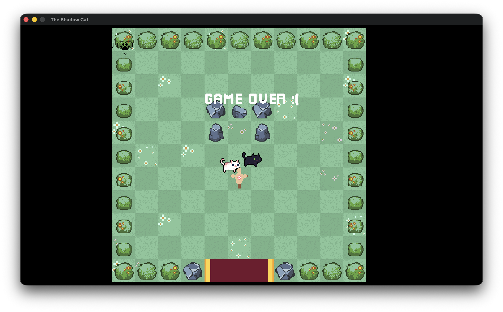
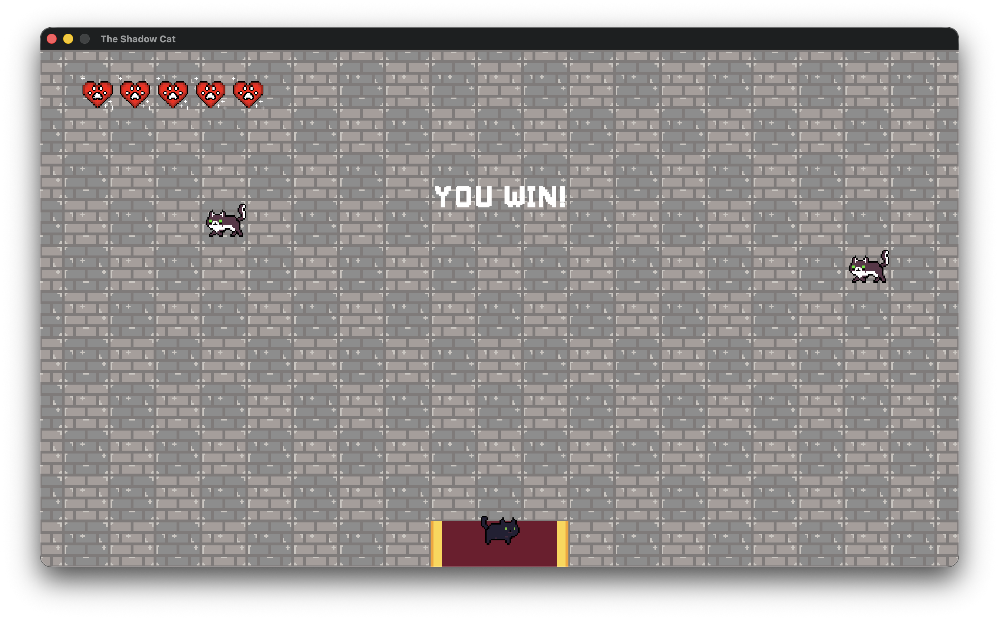

# The Shadow Cat

## Capturas de tela

Tela do menu principal

Gameplay mostrando combate

Lobby com tutorial

Level 1 - Floresta

Level 2 - Arredores

Level 3 - Cidade

---

## Descrição

**The Shadow Cat** é um action roguelike em perspectiva top-down, onde você controla um jovem gato preto ágil e determinado em sua missão de desafiar as facções felinas rivais e restaurar o equilíbrio do reino. O jogo combina um visual fofo em pixel art com mecânicas de combate que recompensam habilidade e aprendizado.

Cada run apresenta salas construídas manualmente, mas povoadas com inimigos e obstáculos. O jogador começa cada tentativa com um número limitado de vidas e precisa atravessar diferentes fases até enfrentar os chefes finais de cada região. Quando todas as vidas se esgotam, a run termina e o jogador recomeça do início, mas com a possibilidade de encontrar itens e habilidades diferentes a cada nova tentativa.

A progressão acontece através da derrota dos inimigos que podem conceder novas habilidades ao jogador, e do avanço para outras fases que é permitido ao derrotar todos eles. O sistema de habilidades permite diferentes estilos de combate, com ataques básicos, ataques carregados, habilidades especiais e movimentos evasivos. A combinação desses elementos garante que nenhuma run seja igual à outra, mantendo o jogo desafiador e interessante mesmo após várias tentativas.

---

## Funcionalidades para testar

Durante o playtest, pedimos atenção especial aos seguintes aspectos:

### Controles e movimentação
- **Responsividade dos controles**: Testar movimentação com teclado (WASD)
- **Precisão do combate**: Avaliar se os ataques (Q para ataque básico na direção do mouse, R para ataque especial) respondem adequadamente
- **Dash/Esquiva**: Verificar se o movimento evasivo (E) funciona como esperado

### Sistema de combate
- **Balanceamento de dano**: Observar se o dano causado e recebido está equilibrado
- **Feedback visual**: Verificar se as animações de ataque e impacto são claras
- **Detecção de colisão**: Reportar qualquer inconsistência entre ataques e hitboxes

### Inimigos e IA
- **Comportamento de patrulha**: Os inimigos devem patrulhar entre dois pontos definidos
- **Detecção do jogador**: O jogador é detectado caso esteja no campo de visão do inimigo ou se chegar perto de mais
- **Perseguição**: Observar se inimigos perseguem o jogador de forma consistente quando detectado
- **Sistema de busca**: Após perder o jogador de vista, inimigos devem procurar na última posição conhecida
- **Retorno à patrulha**: Verificar se inimigos voltam ao padrão de patrulha após desistirem da perseguição

### Interface e HUD
- **Indicador de vida**: Verificar se os corações/barra de vida atualizam corretamente ao receber dano
- **Visibilidade do HUD**: Avaliar se todos os elementos da interface são visíveis e legíveis
- **Tutorial**: Observar se as instruções do tutorial (tecla H para mostrar/esconder) são claras

### Performance e bugs
- **Taxa de quadros**: Reportar qualquer queda de desempenho ou travamentos
- **Colisões com cenário**: Verificar se é possível atravessar paredes ou ficar preso em objetos
- **Camera**: Observar se a câmera segue o jogador adequadamente e respeita os limites do mapa

---

## Controles

### Teclado
- **Movimentação**: W / A / S / D
- **Ataque básico**: Botão Esquerdo do Mouse
- **Ataque especial (Clow Attack)**: Botão Direito do Mouse
- **Ataque a distância (Furball)**: E
- **Ataque pisada (Stomp)**: Q
- **Dash**: Shift
- **Mostrar/Esconder controles (tutorial)**: H
- **Debug (desenvolvedores)**: F1

---

## Créditos

### Equipe de Desenvolvimento

**Filipe Mendes** (2021031920)
- Sistema de colisão e física
- Sistema de habilidades do jogador e upgrades
- Sistema de saúde e mecânicas roguelike
- Sistema de itens (pickups ativos e passivos)

**Gabriel Pains** (2021096887)
- Interface de usuário (HUD)
- Sistema de menus
- Integração de áudio
- Elementos visuais da interface (barra de vida, indicadores)

**Juan Braga** (2021423489)
- Sistema de inimigos e IA
- Comportamentos de patrulha, detecção e perseguição
- Sistema de combate do jogador
- Sistema de câmera e limites de sala

**Thaís Ferreira** (2021092571)
- Sistema de movimentação do jogador
- Sprites e animações dos personagens
- Assets visuais e tilesets
- Arte em pixel art

---

## Tecnologias utilizadas

- **Linguagem**: C++
- **Bibliotecas**: SDL2 (janela, input, áudio, gráficos)
- **Renderização**: OpenGL com GLEW para shaders customizados
- **Editor de arte**: Aseprite
- **Plataformas**: Windows e Linux

---

## Requisitos do sistema

- Sistema operacional: Windows 10+ ou Linux
- OpenGL 3.3+
- SDL2 instalado

---

**Curso**: Introdução ao Desenvolvimento de Jogos - UFMG  
**Data**: Novembro de 2025

