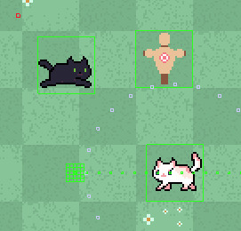

# The Shadow Cat

## Descrição

**The Shadow Cat** é um action roguelike em perspectiva top-down, onde você controla um jovem gato preto ágil e determinado em sua missão de desafiar as facções felinas rivais e restaurar o equilíbrio do reino. O jogo combina um visual fofo em pixel art com mecânicas de combate que recompensam habilidade e aprendizado.

Cada run apresenta salas construídas manualmente, mas povoadas com inimigos e obstáculos. O jogador começa cada tentativa com um número limitado de vidas e precisa atravessar diferentes fases até enfrentar os chefes finais de cada região. Quando todas as vidas se esgotam, a run termina e o jogador recomeça do início, mas com a possibilidade de encontrar itens e habilidades diferentes a cada nova tentativa.

A progressão acontece através da derrota dos inimigos que podem conceder novas habilidades ao jogador, e do avanço para outras fases que é permitido ao derrotar todos eles. O sistema de habilidades permite diferentes estilos de combate, com ataques básicos, ataques carregados, habilidades especiais e movimentos evasivos. A combinação desses elementos garante que nenhuma run seja igual à outra, mantendo o jogo desafiador e interessante mesmo após várias tentativas.

---

## Vídeo de Demonstração

🎬 **[Assista ao gameplay no YouTube](https://youtu.be/D6KMm25wgSw)**

---

## Capturas de tela

Tela do menu principal

Gameplay mostrando sprites

Lobby com tutorial

Level 1 - Floresta

Level 2 - Arredores

Level 3 - Cidade

Tela de Game over

Fim de jogo - Vitória

---

## Funcionalidades para testar

Durante o playtest, pedimos atenção especial aos seguintes aspectos:

### Controles e movimentação
- **Responsividade dos controles**: Testar movimentação com teclado (W/A/S/D)
- **Precisão do combate**: Avaliar se os ataques básicos (Botão Esquerdo do Mouse) e especiais (Botão Direito do Mouse) respondem adequadamente
- **Ataques de habilidade**: Testar o ataque a distância Furball (E) e o ataque Stomp (Q)
- **Dash/Esquiva**: Verificar se o movimento evasivo (Shift) funciona como esperado e oferece a mobilidade necessária
- **Tutorial interativo**: Verificar se o sistema de ajuda (H) mostra e esconde os controles corretamente
- **Sons de passos**: Observar se os sons de passos do jogador variam conforme o terreno (grama, tijolo, pedra)

### Sistema de combate
- **Balanceamento de dano**: Observar se o dano causado e recebido está equilibrado
- **Feedback visual e sonoro**: Verificar se as animações de ataque e impacto são claras e se os efeitos sonoros correspondem às ações
- **Detecção de colisão**: Reportar qualquer inconsistência entre ataques e hitboxes
- **Efeitos sonoros de habilidades**: Confirmar que cada habilidade (ataque básico, Claw Attack, Stomp, Furball, Dash) possui som característico

### Inimigos e IA
- **Comportamento de patrulha**: Os inimigos devem patrulhar entre dois pontos definidos
- **Detecção do jogador**: O jogador é detectado caso esteja no campo de visão do inimigo ou se chegar perto de mais
- **Perseguição**: Observar se inimigos perseguem o jogador de forma consistente quando detectado
- **Sistema de busca**: Após perder o jogador de vista, inimigos devem procurar na última posição conhecida
- **Retorno à patrulha**: Verificar se inimigos voltam ao padrão de patrulha após desistirem da perseguição

### Interface e HUD
- **Indicador de vida**: Verificar se os corações/barra de vida atualizam corretamente ao receber dano
- **Visibilidade do HUD**: Avaliar se todos os elementos da interface são visíveis e legíveis
- **Tutorial**: Observar se as instruções do tutorial (tecla H para mostrar/esconder) são claras
- **Telas de vitória e _Fim de Jogo_**: Conferir se o jogo é interrompido e a tela de _Game Over_ aparece quando a vida do player acaba, e se ao chegar no fim da Fase 3 o jogo declara a vitória do jogador
- **Música de fundo**: Avaliar se a música ambiente está adequada para cada fase e se as transições são suaves

### Sistema de áudio
- **Música ambiente**: Verificar se cada cena (menu, lobby, níveis 1-3, chefes 1-3) possui música de fundo apropriada
- **Transição entre salas**: Confirmar que o som de transição toca ao passar de uma sala para outra
- **Volume balanceado**: Avaliar se o volume da música e efeitos sonoros está equilibrado

### Performance e bugs
- **Taxa de quadros**: Reportar qualquer queda de desempenho ou travamentos
- **Colisões com cenário**: Verificar se é possível atravessar paredes ou ficar preso em objetos
- **Camera**: Observar se a câmera segue o jogador adequadamente e respeita os limites do mapa

---

## Controles

### Teclado
- **Movimentação**: W / A / S / D
- **Ataque básico**: Botão Esquerdo do Mouse
- **Ataque especial (Claw Attack)**: Botão Direito do Mouse
- **Ataque a distância (Furball)**: E
- **Ataque pisada (Stomp)**: Q
- **Dash**: Shift
- **Mostrar/Esconder controles (tutorial)**: H
- **Debug (desenvolvedores)**: F1

---

## Recursos e funcionalidades

### Sistema de áudio completo
- **Música ambiente dinâmica**: Cada cena do jogo possui trilha sonora exclusiva que define o clima da experiência
  - Menu principal com música relaxante
  - Lobby/tutorial com tema acolhedor
  - Três níveis com músicas progressivamente mais intensas
  - Três batalhas de chefes com músicas épicas de combate
- **Efeitos sonoros de habilidades**: Todas as habilidades do jogador e inimigos possuem sons únicos
  - Ataque básico com variações
  - Claw Attack (ataque especial)
  - Stomp (pisada no chão)
  - Furball (projétil)
  - Dash (movimento rápido)
- **Sons ambientes contextuais**: 
  - Sons de passos que variam conforme o tipo de terreno (grama, tijolo, pedra)
  - Som de transição ao mudar de sala
- **Balanceamento de volume**: Volumes ajustados individualmente para cada tipo de som, garantindo uma experiência auditiva agradável

### Sistema de progressão
- **Transições entre níveis**: Portal visual aparece ao derrotar todos os inimigos, permitindo avançar para a próxima fase
- **Sistema de habilidades**: Ataques variados com diferentes alcances, danos e cooldowns
- **Sistema de upgrade**: Melhoria de habilidades ao longo do jogo

---

## Créditos

### Equipe de Desenvolvimento

**Filipe Mendes** (2021031920)
- Sistema de colisão e física
- Sistema de habilidades do jogador e upgrades
- Sistema de saúde e mecânicas roguelike
- Sistema de itens (pickups ativos e passivos)

**Gabriel Pains** (2021096887)
- Interface de usuário (HUD)
- Sistema de menus
- Integração de áudio
- Elementos visuais da interface (barra de vida, indicadores)

**Juan Braga** (2021423489)
- Sistema de inimigos e IA
- Comportamentos de patrulha, detecção e perseguição
- Sistema de combate do jogador
- Sistema de câmera e limites de sala

**Thaís Ferreira** (2021092571)
- Sistema de movimentação do jogador
- Sprites e animações dos personagens
- Assets visuais e tilesets
- Arte em pixel art

---

### Créditos de áudio

**Músicas** (de *The Legend of Zelda: Ocarina of Time* e *Majora's Mask*, *Return of the Obra Dinn*, *8bit Doves*)
- Menu principal: "Sweet Dreams" - 8bit Doves
- Lobby: "House" - The Legend of Zelda: Ocarina of Time OST
- Level 1: "Kokiri Forest" - The Legend of Zelda: Ocarina of Time OST
- Level 2: "Opening Scene" - The Legend of Zelda: Majora's Mask OST (Remastered)
- Level 3: "A Bitter Cold" - Return of the Obra Dinn Soundtrack
- Boss 1: "Nightmare" - 8bit Doves
- Boss 2: "Dinosaur Boss Battle" - The Legend of Zelda: Ocarina of Time OST
- Boss 3: "Boss Battle" - The Legend of Zelda: Ocarina of Time OST
- Vitória: "8-bit Game" (Pixabay)
- Game Over: "Boss Clear" - The Legend of Zelda: Ocarina of Time OST

**Efeitos sonoros** (de *The Legend of Zelda: Breath of the Wild*, bfxr.net, e outros)
- Sons de passos e ambiente: Variações de Zelda: Breath of the Wild e bfxr.net
- Sons de habilidades: Criados com bfxr.net
- Sons de interface: The Legend of Zelda: Breath of the Wild

_Para lista completa de fontes de áudio, consulte o arquivo `sounds.csv` no repositório._

---

## Tecnologias utilizadas

- **Linguagem**: C++
- **Bibliotecas**: SDL2 (janela, input, renderização), SDL_mixer (áudio), SDL_image (texturas), SDL_ttf (fontes)
- **Renderização**: OpenGL com GLEW para shaders customizados
- **Editor de arte**: Aseprite (sprites e animações)
- **Áudio**: SDL_mixer para reprodução de músicas e efeitos sonoros
- **Ferramentas de som**: bfxr.net para criação de efeitos sonoros
- **Plataformas**: Windows e Linux

---

## Requisitos do sistema

- Sistema operacional: Windows 10+ ou Linux
- OpenGL 3.3+
- SDL2, SDL_mixer, SDL_image, SDL_ttf instalados
- Aproximadamente 100 MB de espaço livre em disco

---

**Curso**: Introdução ao Desenvolvimento de Jogos - UFMG  
**Data**: Dezembro de 2025

